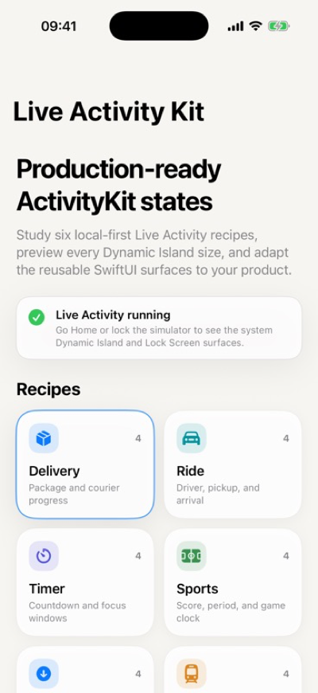

# Live Activity & Dynamic Island Kit



[](#)
[](#)
[](#)
[](LICENSE)

A production-oriented SwiftUI template for building Live Activities and Dynamic Island experiences with clean state models, reusable UI surfaces, and a real WidgetKit demo project.

Part of the Apple Design Templates collection.

## Scenarios

The template includes six practical scenarios:

| Scenario | Good for |
| --- | --- |
| Delivery | courier, food, package, marketplace tracking |
| Ride | taxi, pickup, driver arrival, shared transport |
| Timer | focus, workout, meditation, cooking, study sessions |
| Sports | live score, match clock, period-based status |
| Download | file transfer, media sync, offline maps, imports |
| Trip | boarding, gate, route progress, travel timeline |

## What is inside

- Reusable SwiftUI components for Lock Screen cards, compact Dynamic Island, minimal Dynamic Island, and expanded Dynamic Island.
- ActivityKit attributes and content state wired for local start, update, and end flows.
- Runtime timeline snapshots keep real Live Activities fresh even when the static demo data is reused later.
- Deterministic recipe data for six scenarios, so designers and developers can iterate without backend setup.
- A complete Xcode demo app with a WidgetKit extension.
- Package tests for recipe coverage, progress clamping, deep links, and accessibility summaries.
- A real simulator screenshot for the public preview and reproducible component preview assets generated by `Tools/render_preview_assets.py`.

## Run the demo

Requirements:

- Xcode 26 or newer
- iOS 17 or newer simulator/device
- Swift 6

Open:

```bash
open Examples/LiveActivityDemo/LiveActivityDemo.xcodeproj
```

Choose the `LiveActivityDemo` scheme and run on an iPhone simulator or device. In the app, choose a scenario, start the Live Activity, and move through the timeline states.

Optional: regenerate the Xcode project with XcodeGen:

```bash
cd Examples/LiveActivityDemo
xcodegen generate
open LiveActivityDemo.xcodeproj
```

XcodeGen is not required. The checked-in `.xcodeproj` remains ready to open directly.

Run package tests:

```bash
swift test
```

Compile the demo app from Terminal:

```bash
xcodebuild \
  -project Examples/LiveActivityDemo/LiveActivityDemo.xcodeproj \
  -scheme LiveActivityDemo \
  -destination 'generic/platform=iOS Simulator' \
  CODE_SIGNING_ALLOWED=NO \
  build
```

## Integrate into your app

1. Add the package or copy `Sources/LiveActivityKit` into your project.
2. Keep your app target and widget extension target connected to the same `LiveActivityAttributes`.
3. Add `NSSupportsLiveActivities` to the app target.
4. Replace `LiveActivityRecipes` with your own domain states.
5. Keep Live Activity updates short, glanceable, and state-driven.

Detailed integration notes are in [Docs/INTEGRATION.md](Docs/INTEGRATION.md).

## Structure

```text
Sources/LiveActivityKit/
  Models/      state, porcelain palette, attributes, deep links
  Recipes/     scenario data and timeline states
  Views/       Lock Screen and Dynamic Island SwiftUI surfaces

Examples/LiveActivityDemo/
  LiveActivityDemo/         demo app and local controller
  LiveActivityDemoWidgets/  real WidgetKit ActivityConfiguration

Docs/
  ARCHITECTURE.md
  CUSTOMIZATION.md
  INTEGRATION.md
```

## Design principles

- One state model drives every surface.
- The Lock Screen card carries context; the island surfaces stay glanceable.
- Motion and progress are calm, not decorative.
- The visual system uses one porcelain palette by default, so the demo stays stable and easy to adapt.
- The demo data is realistic enough for product work but small enough for beginners to understand.

Official Apple references:

- [ActivityKit](https://developer.apple.com/documentation/activitykit)
- [Displaying live data with Live Activities](https://developer.apple.com/documentation/activitykit/displaying-live-data-with-live-activities)
- [DynamicIsland](https://developer.apple.com/documentation/widgetkit/dynamicisland)
- [Launching your app from a Live Activity](https://developer.apple.com/documentation/activitykit/launching-your-app-from-a-live-activity)

## License

MIT. Use it in personal, commercial, and open-source projects.
