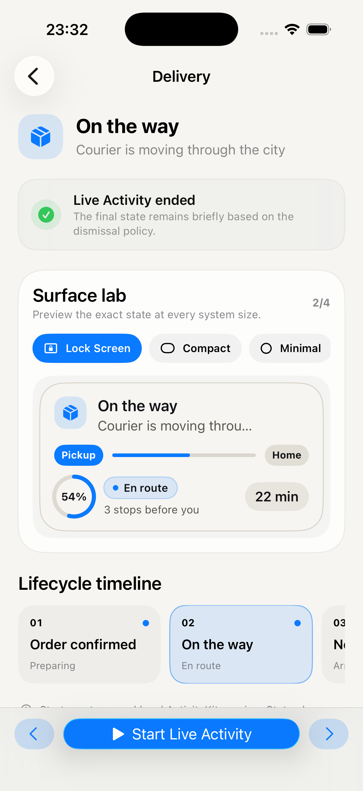

# Live Activity & Dynamic Island Kit

<p align="center">
  
  
</p>

[](#)
[](#)
[](https://github.com/mikonyaa/LiveActivityDynamicIslandKit/actions/workflows/ci.yml)
[](LICENSE)

A focused SwiftUI rendering kit for Live Activities and Dynamic Island, paired with a complete local ActivityKit lab. The package owns presentation; your app keeps its attributes, lifecycle, routing, and product state.

Part of the [Apple Design Templates](https://github.com/mikonyaa/Apple-Design-Templates) collection.

## Why this template

- Four reusable system surfaces: Lock Screen, compact, minimal, and expanded Dynamic Island.
- One domain-neutral model carrying content, progress, symbol, accent, timeline, and accessibility text.
- Adaptive built-in Porcelain appearance plus public light/dark palettes for product branding.
- A real app and WidgetKit extension with start, update, recovery after relaunch, exact deep links, and end.
- Six deterministic recipes — delivery, ride, timer, sports, transfer, and trip — with no backend setup.
- Swift 6, zero runtime dependencies, package tests, demo tests, strict SwiftLint, and reproducible XcodeGen output.

## Run the Activity Lab

Requirements: Xcode 26+, Swift 6, and an iOS 17+ simulator.

```bash
open Examples/LiveActivityDemo/LiveActivityDemo.xcodeproj
```

Run the `LiveActivityDemo` scheme, open a recipe, and press **Start**. Move through the lifecycle timeline to update the real system presentation. The demo restores an active session after app relaunch and prevents duplicate activities.

The checked-in project is ready to open. To reproduce it with the pinned XcodeGen version:

```bash
cd Examples/LiveActivityDemo
xcodegen generate
open LiveActivityDemo.xcodeproj
```

## Add the package

In Xcode, add:

```text
https://github.com/mikonyaa/LiveActivityDynamicIslandKit.git
```

Or declare the release in `Package.swift`:

```swift
dependencies: [
    .package(
        url: "https://github.com/mikonyaa/LiveActivityDynamicIslandKit.git",
        from: "0.1.0"
    )
]
```

Link `LiveActivityKit` to both your app and widget-extension targets:

```swift
.product(name: "LiveActivityKit", package: "LiveActivityDynamicIslandKit")
```

## Integration boundary

The package intentionally does not define `ActivityAttributes` or a generic lifecycle service. Those types carry product identity and belong to your app.

1. Define app-owned `ActivityAttributes` in a file shared by the app and widget targets.
2. Add `NSSupportsLiveActivities` to the app target.
3. Map product state into `LiveActivityContentModel`.
4. Compose the package views inside `ActivityConfiguration`.
5. Start, update, restore, and end activities from your own lifecycle owner.

See [Integration](Docs/INTEGRATION.md), [Architecture](Docs/ARCHITECTURE.md), and [Customization](Docs/CUSTOMIZATION.md) for production-shaped examples.

## Custom appearance

Use the built-in adaptive theme:

```swift
LiveActivityLockScreenCard(model: model, theme: .porcelain)
```

Or pass independent light and dark palettes without forking the package:

```swift
let appearance = LiveActivityAppearance(
    light: lightPalette,
    dark: darkPalette
)

LiveActivityLockScreenCard(model: model, appearance: appearance)
```

Existing theme-based initializers remain source compatible.

## Verify locally

```bash
swift test
swiftlint lint --strict
xcodebuild \
  -project Examples/LiveActivityDemo/LiveActivityDemo.xcodeproj \
  -scheme LiveActivityDemo \
  -destination 'generic/platform=iOS Simulator' \
  CODE_SIGNING_ALLOWED=NO \
  build
```

The release matrix and recorded simulator evidence are in [Docs/RELEASE-0.1.0.md](Docs/RELEASE-0.1.0.md).

## Repository map

```text
Sources/LiveActivityKit/     reusable models, appearance, and SwiftUI surfaces
Tests/LiveActivityKitTests/  public package behavior

Examples/LiveActivityDemo/
  LiveActivityDemo/          Activity Lab and recoverable local lifecycle
  LiveActivityDemoWidgets/   real ActivityConfiguration and Dynamic Island
  LiveActivityDemoTests/     routing and lifecycle policy tests
  Shared/                    app-owned attributes, scenarios, and routes

Docs/                        integration, customization, migration, and release notes
```

## Design rules

- Keep the information glanceable and the most important value immediately readable.
- Drive every surface from one content state.
- Use progress only when its meaning is clear.
- Deep-link to the exact represented state.
- End the Live Activity when the tracked event ends.
- Keep app identity and side effects outside the rendering package.

Official references: [ActivityKit](https://developer.apple.com/documentation/activitykit), [Live Activities](https://developer.apple.com/design/human-interface-guidelines/live-activities), and [DynamicIsland](https://developer.apple.com/documentation/widgetkit/dynamicisland).

## License

MIT. Use it in personal, commercial, and open-source projects.
